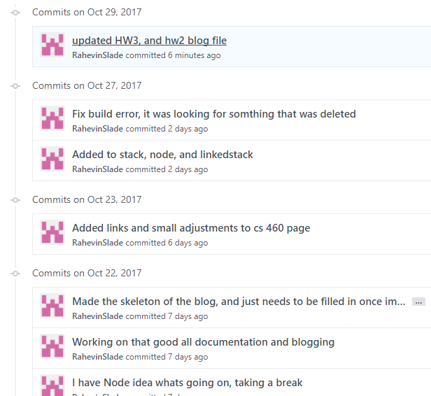
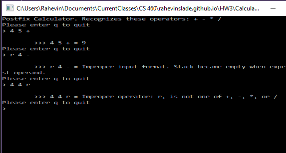

# Rahevin's HW3 Blog

Below are the requirements for homework 3

1)  Uses Git branching, all commits are done on branch HW3
```
git branch
git checkout HW3
git add .
git commit -m "Example, Node-bodies code here"
git push origin HW3
```
    
2) Commits show that code was written from scratch

The image below shows some of my commits, showing I have been editing and commiting my code, slowly showin progress. 


    

3)  Code Compiles

The image below shows a screenshot of my code compiling and testing different inputs.


    

4)  Built in typenames like string and object are lowercase

Bits from Calculator.cs code(bits of code not in order, just a demostration of the requirment)
```
string userinput;
double a = 0.0;
double b = 0.0;
double c = 0.0;
```

Bits from the Node.cs code
```
        public Node(object data, Node next)
        {
            Data = data;//this is the public node for all
            Next = next;
        }
```
    
5)  Method names and public fields start with Upper case, private and local variables start with lower case
```
    //gathers and parses the users input and determines if it is "good" input 
        public string PostFixInput(string userinput)
        {
            string e; // this will be our error message
            if((userinput == null) || (userinput == ""|| (userinput == " ")))// we will not tolerate nulls or empty inputs
                {
                e = "Null or the empty string are not valid postfix expressions.";//string to return to the user
                //mystack.Clear();//Clears the stack because there is no input
                return e;
            }
```

    
6)  Interface typename starts with an I, like Istack

well in this case I called it
IFace, because it is an InterFace.
```
namespace Calculator
{
    interface IFace//Here is our interface, where we will create methods but not define them
    {//we will have push, pop, peek, and isempty, and clear
        object Push(object newItem);
        object Pop();
        object Peek();
        bool IsEmpty();
        void Clear();
    }
}
```

    
7)  Node class uses properties
```
public class Node
    {
        public object Data; //Creating an object inside the node called Data, information
        public Node Next;//creating a feature that will take you to the next node in line.

        public Node()//this is the creation of the node
        {
            Data = null;//carries but two item, the information, and whats next.
            Next = null;//set the first next to point to nothing just in case
        }

        public Node(object data, Node next)
        {
            Data = data;//this is the public node for all, stores the inforamtion
            Next = next;//this will point to the next node
        }
    }
```
    


