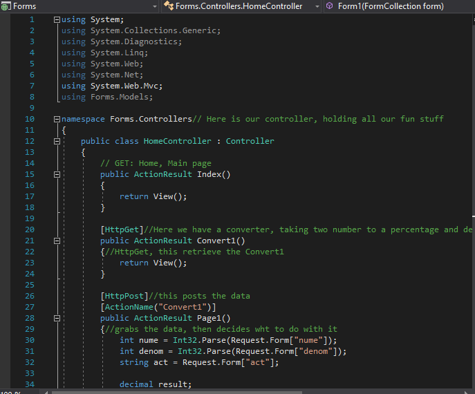
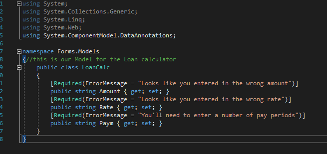
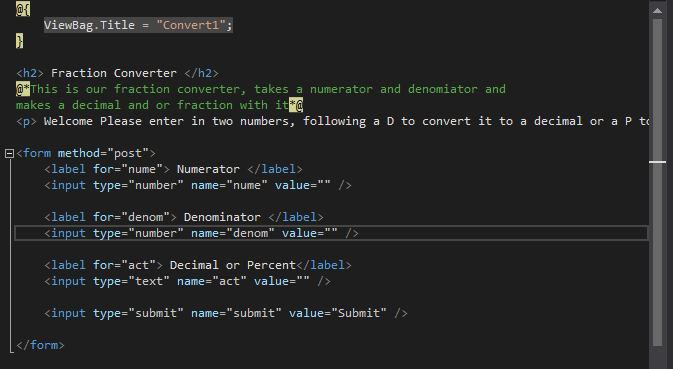
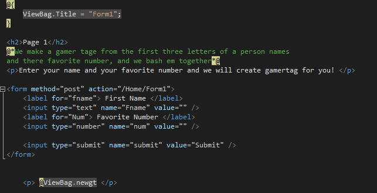
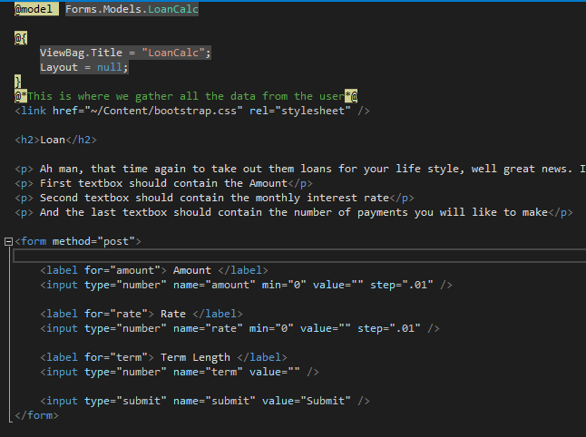

# Rahevin's HW4 Blog

Below are the requirements for homework 4!

1) creat a new empty MVC project. Include a .gitignore correctly.

For this I first created a templet and played around with it to see how it works,
this one is called HomeA, the empty MVC project that was used to fill the requirements
of the this assignment is called Form.

2) Implement a feature branch and once down merge back to the master branch.

The feature branch for this assignment is called HW4. Through this project, you'll notice comments ranging on what I accomplished to what I'm working on.

3) Create a "Home" default landing page, that contains links in an ul, and must use Razor @html.ActionLink. 

Snippet of the home page
```
@{
    ViewBag.Title = "Index";
}

<h2>Welcome</h2>
@*Welcome home, this will be our home page*@
<p> The assignment for HW4 </p>
<ul>
```

Snippet of the use of Razor, where I put the links for the other pages
```
                <ul class="nav navbar-nav">
                    @*Here we have our links to the other pages to perform there designated tasks*@
                    <li>@Html.ActionLink("Home","Index","Home")</li>
                    <li>@Html.ActionLink("Form1", "Form1", "Home")</li>
                    <li>@Html.ActionLink("Convert1", "Convert1", "Home")</li>
                    <li>@Html.ActionLink("Loan", "Loan", "Home")</li>
                    
                </ul>
```

4) Create a new page, that contains at least two text fields and a submit button. uses GET and Request. 

The page created for this part of the assignment is called Convert1, which takes in two numbers and an action. Depending on the action the user wants, the program will basically create a Percentage out of the number and same way it will create a Decimal version. The numbers used are called the Numerator and Denomitor. The user enters a P or p for percentage similar to D or d for decimal. 

Snippet from Convert1
```
@{
    ViewBag.Title = "Convert1";
}

<h2> Fraction Converter </h2>
@*This is our fraction converter, takes a numerator and denomiator and 
makes a decimal and or fraction with it*@
<p> Welcome Please enter in two numbers, following a D to convert it to a decimal or a P to convert to a percentage. </p>

<form method="post">
    <label for="nume"> Numerator </label>
    <input type="number" name="nume" value="" />
    <label for="denom"> Denominator </label>
    <input type="number" name="denom" value="" />
    <label for="act"> Decimal or Percent</label>
    <input type="text" name="act" value="" />
    <input type="submit" name="submit" value="Submit" />

</form>
```

Snippet within our HomeController
```
       [HttpGet]//Here we have a converter, taking two number to a percentage and decimal
        public ActionResult Convert1()
        {//HttpGet, this retrieve the Convert1
            return View();
        }

[HttpPost]//this posts the data
        [ActionName("Convert1")]
        public ActionResult Page1()
        {//grabs the data, then decides wht to do with it
            int nume = Int32.Parse(Request.Form["nume"]);
            int denom = Int32.Parse(Request.Form["denom"]);
            string act = Request.Form["act"];

            decimal result;
            //if the input is P, p it finds the percentage
            if(act == "P" || act == "p")
            {
                result = ((decimal)nume / denom) * 100;
                result = Math.Round(result, 2);
            }
```
Not all the code is here but, the rest goes on the deteremine if the user put in D or d for decimal. If the user didn't put in those commands then the program will display a message informing the user that they didn't enter in the right information.

5) Create another page, that does almost the same as the last page but, uses a parametereless GET and POST, uses FormCollection.

The page that was first created is called Form1, which grabs a users name and favorite number, and creates a new gamertag for them.

Snippet from Form1 page
```
@{
    ViewBag.Title = "Form1";
}
<h2>Page 1</h2>
@*We make a gamer tage from the first three letters of a person names
and there favorite number, and we bash em together*@
<p>Enter your name and your favorite number and we will create gamertag for you! </p>
<form method="post" action="/Home/Form1">
    <label for="fname"> First Name </label>
    <input type="text" name="Fname" value="" />
    <label for="Num"> Favorite Number </label>
    <input type="number" name="num" value="" />

    <input type="submit" name="submit" value="Submit" />
</form>
    <p> @ViewBag.newgt </p>
```
Snippet from the HomeController using GET and Request
```
[HttpGet]//this gets the form1 to view
        public ActionResult Form1() => View();
[HttpPost]//this is where we post the data,   
        public ActionResult Form1(FormCollection form)
        {   //finds the data based on name of the item
            string fname = Request.Form["fname"];
            int num = Int32.Parse(Request.Form["num"]);
            string gt;//this will be the new gamer tag
```
Within the above method, we take the first three letters of their name and concatinate it with their favorite number to create a simple gamertag for the individual to use.

6) Create a Loan calculator, with either Razor HTML,GET or POST. Also use model binding.

This one I decide to make the Loan calculator, I created warning and limitation so the user can't move forward without putting in the right information.

Snippet from the Model
```
namespace Forms.Models
{//this is our Model for the Loan calculator
    public class LoanCalc
    {//ErrorMessage is our well error message that tell the user they did something wrong
        [Required(ErrorMessage = "Looks like you entered in the wrong amount")]
        public string Amount { get; set; }
        [Required(ErrorMessage = "Looks like you entered in the wrong rate")]
        public string Rate { get; set; }
        [Required(ErrorMessage = "You'll need to enter a number of pay periods")]
        public string Paym { get; set; }
    }
}
```
Snippet from the HomeController for Loans
```
[HttpPost]//This is where we will post the data and do the functions
        [ActionName("Loan")] //LoanCalc  loanCalc
        public ActionResult LoanAnswer(string amount, string rate, string term)
        {   //finds and converts the data to a double
            double amount1 = Convert.ToDouble( Request.Form["amount"]);
            double rate1 = Convert.ToDouble(Request.Form["rate"]) / 100 ;
            double term1 = Convert.ToDouble(Request.Form["term"]);
            //perform the math one step at a time so its easier to read
            double top = (rate1 * amount1);
            double bottom = (Math.Pow((1 + rate1), (-1 * term1)));

            double payment = top / (1 - bottom);
```
After we compute the math, we then tell the user all the information they entered in, then we tell them the monthly pay for the number of terms they wish to pay off their loan. 

Find it in my GitHub [here](https://github.com/RahevinSlade/rahevinslade.github.io/tree/master/HW4/Forms/Forms)

Screen Shots!

Here's the controllers, that holds all of our information of views.
 

Here is the loan model I am using for this project, this send errors to the user if the input is bad.
 

This is the landing page or Home page.
 

This is the Fraction or Percent Converter page, this takes in two numbers from the user and a "d" if the user wants a decimal, or a "p" if they wish to see it in a percent form.


This is the form of the project, which takes in first/last name from the user and a number and generates a new gamertag for them. Then displays it through ViewBag.newgt (new game tag)


Lastly I decided to create the LoanCalc described in the homework, which takes in three numberals from the user and calculates how much a user needs per month to pay off their loans. Then after the user Submits it takes them to a new page and displays their results.
