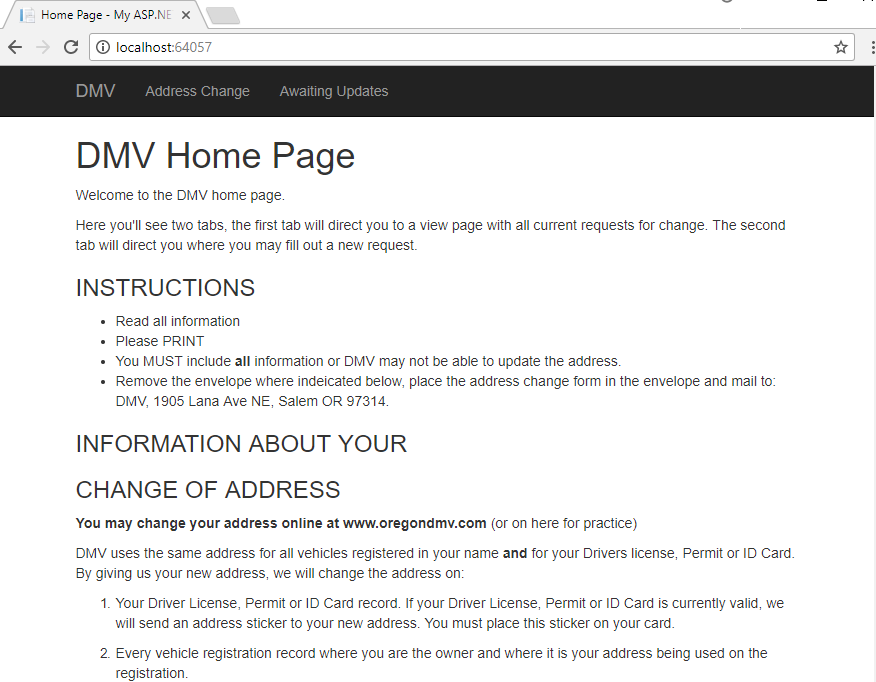
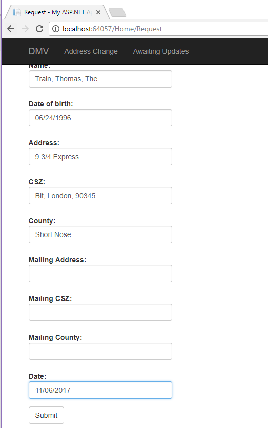
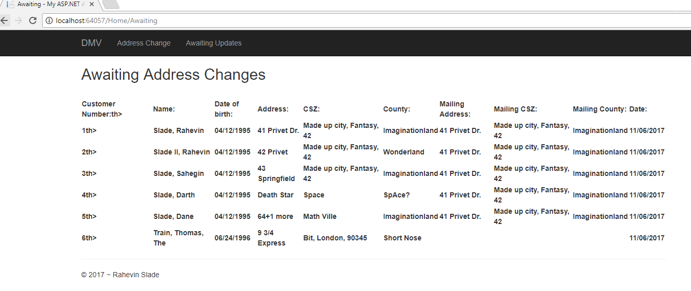
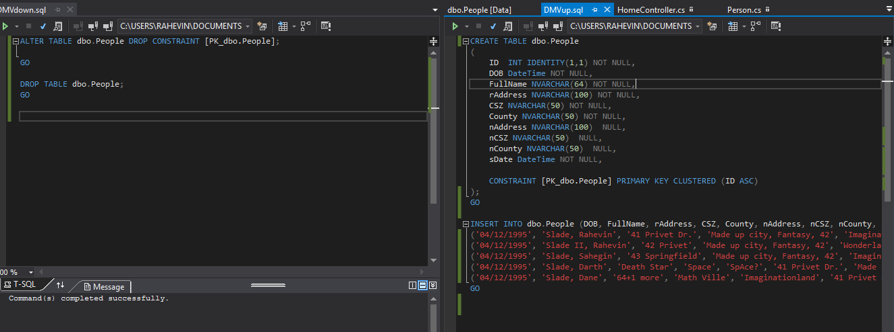
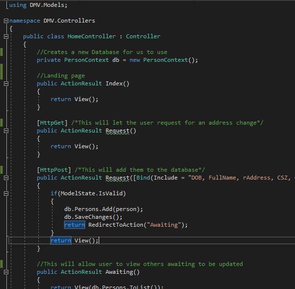
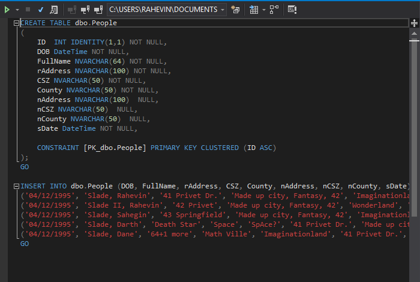

# Rahevin's HW5 Blog

1) Create a new empty MVC project, and create a home landing page.

This project is called DMV, and the landing page is inside of Views folder called Index, which serves as the landing page and instructions page.

2) Include two more pages, one to request information, the other to display the requested information.

The page used to gather information from the user is called Request, this uses Razor to communicate with the data base and add it to my DMV data. The second page is called Awaiting, which is the page the displays all current awaiting persons to have there address updated.

Request Page
```
@model DMV.Models.Person

@{
    ViewBag.Title = "Request";
}
<h2><b> CHANGE OF ADDRESS NOTICE </b></h2>
<h2><b> FOR DMV RECORDS </b></h2>

<p> <b>NOTE:</b> ALL information is REQUIRED to change you address.</p>

@* id, dob, lname, fname, mname, address, city, state, zip, country *@
 @*New address, ncity, nstate, nzip, ncountry, date*@
@using (Html.BeginForm())
{ 
    @Html.AntiForgeryToken()

    <div class="form-horizontal">
        <h4>User</h4>
        <hr />
        @Html.ValidationSummary(true, "", new { @class = "text-danger" })
        <div class="form-group">
            @Html.LabelFor(model => model.FullName, htmlAttributes: new { @class = "control-label col-md-2" })
            <div class="col-md-10">
                @Html.EditorFor(model => model.FullName, new { htmlAttributes = new { @class = "form-control" } })
                @Html.ValidationMessageFor(model => model.FullName, "", new { @class = "text-danger" })
            </div>
        </div>
```

Awaiting
```
<h2>Awaiting Address Changes</h2>

<br />
<div class="table-div">
  
    <table>
        <tr>
            <th>@Html.DisplayNameFor(model => model.ID)th>
            <th>@Html.DisplayNameFor(model => model.FullName)</th>

            skipping some redundent coding to safe space in Blog

 @foreach (var item in Model)
        {
                <tr>
                    <th>@Html.DisplayFor(modelItem => item.ID)th>
                    <th>@Html.DisplayFor(modelItem => item.FullName)</th>            

```

3) Include everything on the form provided on a DMV Address change, which is 9 fields. 

In this program I have 10 fields, the ID I generate in the Database, while the other 9 I gather from the user, which includes the new residence address and new mailling address. 

```
ID	INT IDENTITY(1,1) NOT NULL,
	DOB DateTime NOT NULL,
	FullName NVARCHAR(64) NOT NULL,
	rAddress NVARCHAR(100) NOT NULL,
	CSZ NVARCHAR(50) NOT NULL,
	County NVARCHAR(50) NOT NULL,
	nAddress NVARCHAR(100)  NULL,
	nCSZ NVARCHAR(50)  NULL,
	nCounty NVARCHAR(50)  NULL,
	sDate DateTime NOT NULL,
```
4) Design and create the database, have only a signle table that uses a primary key, populate it with a few example. Have one Upsql that creates entries, and another Downsql that clears it. 

Going up sql, these will be inserted into the table I created
```
INSERT INTO dbo.People (DOB, FullName, rAddress, CSZ, County, nAddress, nCSZ, nCounty, sDate) VALUES
('04/12/1995', 'Slade, Rahevin', '41 Privet Dr.', 'Made up city, Fantasy, 42', 'Imaginationland', '41 Privet Dr.', 'Made up city, Fantasy, 42', 'Imaginationland',GETDATE()),
('04/12/1995', 'Slade II, Rahevin', '42 Privet', 'Made up city, Fantasy, 42', 'Wonderland', '41 Privet Dr.', 'Made up city, Fantasy, 42', 'Imaginationland',GETDATE()),
('04/12/1995', 'Slade, Sahegin', '43 Springfield', 'Made up city, Fantasy, 42', 'Imaginationland', '41 Privet Dr.', 'Made up city, Fantasy, 42', 'Imaginationland',GETDATE()),
('04/12/1995', 'Slade, Darth', 'Death Star', 'Space', 'SpAce?', '41 Privet Dr.', 'Made up city, Fantasy, 42', 'Imaginationland',GETDATE()),
('04/12/1995', 'Slade, Dane', '64+1 more', 'Math Ville', 'Imaginationland', '41 Privet Dr.', 'Made up city, Fantasy, 42', 'Imaginationland',GETDATE());
GO
```

And going Down, this should clear everything within the table and start anew.
```
ALTER TABLE db.People DROP CONSTRAINT [PK_dbo.People];
GO

DROP TABLE dbo.People;

GO
```

5) Model class and database context class.

I created a model class called person, cause I believe a person is being added to the database so it made sense to name it person? But this is what it looks like ,
```
using System.ComponentModel.DataAnnotations;

namespace DMV.Models
{
    public class Person
    {
        [Display(Name = "Customer Number:"), Required]
        public int ID { get; set; }

        [Display(Name = "Date of birth:"), DisplayFormat(DataFormatString = "{0:MM/dd/yyyy}"), Required]
        public DateTime DOB { get; set; }
```

For the database context class, I named this one PersonContex,

```
using DMV.Models;
using System.Data.Entity;

namespace DMV.DAL
{
    public class PersonContext : DbContext
    {
        public PersonContext() : base("name=PersonContext")
        {

        }
        public virtual DbSet<Person> Persons { get; set; }
    }
}
```
It pretty much sets up Person to be used by the Users, so that it has a guide line of what and what not to input and types of inputs.

6) Connect to the database

In my Web.config I added this bit that allows me to connect to my local database called DMVdb

```
  <connectionStrings>
    <add name="PersonContext" connectionString="Data Source=(LocalDB)\MSSQLLocalDB;AttachDbFilename=C:\Users\Rahevin\Documents\CurrentClasses\CS 460\rahevinslade.github.io\HW5\DMV\DMV\App_Data\DMVdb.mdf;Integrated Security=True" providerName="System.Data.SqlClient"/>
  </connectionStrings>
```

7) Create controller and action methods

Inside my HomeController, I create a private PersonContext db in which I use to Add a person, save changed, then once all done, I redirect the individual to view their entry inside of Awaiting.

```
private PersonContext db = new PersonContext();

        public ActionResult Index()
        {
            return View();
        }

        [HttpGet]
        public ActionResult Request()
        {
            return View();
        }

        [HttpPost]
        public ActionResult Request([Bind(Include = "DOB, FullName, rAddress, CSZ, County, nAddress, nCSZ, nCounty, sDate")]Person person)
        {
            if(ModelState.IsValid)
            {
                db.Persons.Add(person);
                db.SaveChanges();
                return RedirectToAction("Awaiting");
            }
            return View();
        }
```
8) Create Strongly typed Views.

Insided of Request, there is, which is used to extract the data from the user, then add it to the database.

```
@using (Html.BeginForm())
{ 
    @Html.AntiForgeryToken()

    <div class="form-horizontal">
        <h4>User</h4>
        <hr />
        @Html.ValidationSummary(true, "", new { @class = "text-danger" })
        <div class="form-group">
            @Html.LabelFor(model => model.FullName, htmlAttributes: new { @class = "control-label col-md-2" })
            <div class="col-md-10">
                @Html.EditorFor(model => model.FullName, new { htmlAttributes = new { @class = "form-control" } })
                @Html.ValidationMessageFor(model => model.FullName, "", new { @class = "text-danger" })
            </div>
        </div>

        <div class="form-group">
            @Html.LabelFor(model => model.DOB, htmlAttributes: new { @class = "control-label col-md-2" })
            <div class="col-md-10">
                @Html.EditorFor(model => model.DOB, new { htmlAttributes = new { @class = "form-control" } })
                @Html.ValidationMessageFor(model => model.DOB, "", new { @class = "text-danger" })
            </div>
        </div>
```

Find it in my Github [here](https://github.com/RahevinSlade/rahevinslade.github.io/tree/master/HW5/DMV/DMV)

9) DEMO's






ScreenShots of Code!

Here is the HomeController that will create our database to use, manage views, and what to do with them.


Here is where we actually create the table and populate it with 5 examples, not a whole lot of original inputs..


And respectfull this is the down page, where we remove all people from the table, thus clearing the data
