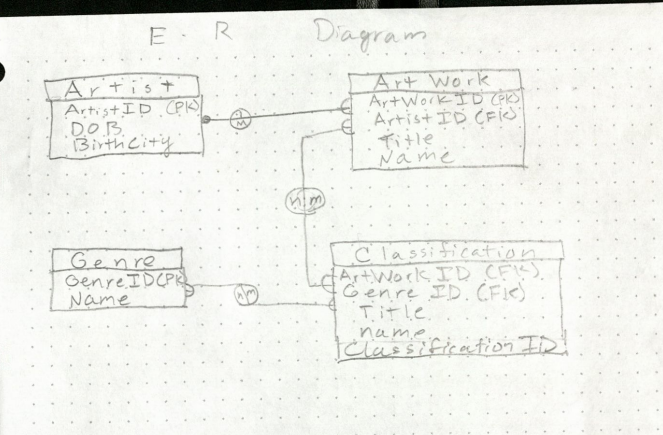
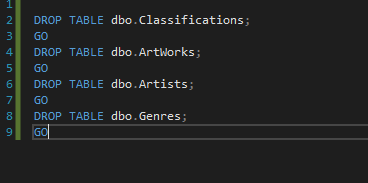
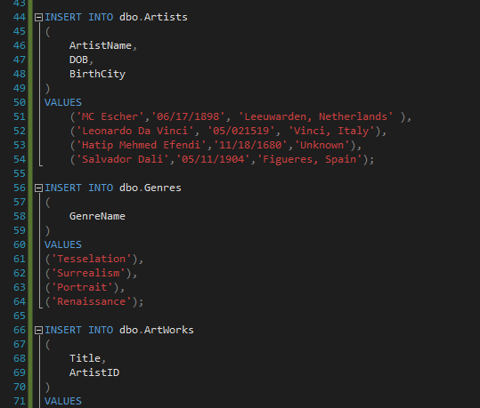
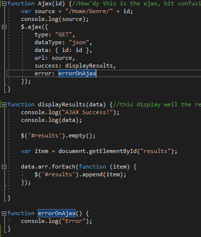

# Rahevin's HW8 Blog

1) Has scripts to create, populate and delete the database

Created an Up and Down Sql script along with the .mdf file to store everything in. Also created a ER Diagram on paper before creating and UP script.








2) Tables have appropriate names, genres,relations/constraints and classifications. 
Artists has an ID that is a foriegn key to Artworks, and Artworks has a foriegn key in Classification, and Genres has a foriegn key in Classifications. 


3) Main page has menu, with lists pages showing all entities

Menu page displays links to the next pages which will display all entites within the following table and details.


4) Has a working CRUD functionality for artists.

I used auto gen code and then edited to work for my written code. To view more watch the Demo video after step 6.


5) Has a genres buttons, shows works and artists, sorted correctly

This is what uses Ajax for the menu buttons, inside the Home View Index. 
```
    @foreach (var item in Model.ToList())
    {
        <button class="btn btn-primary" onclick="Ajax('@item.GenreID');">@item.GenreName</button>
    }
```


6) Uses AJAX

Ajax is saved inside of scripts and when including in a file we do the following. Saved as gajax.js

```
@section Javascript
{
    <script type="text/javascript" src="@Url.Content("/Scripts/gajax.js")"></script>
}
```



Demo's

Find it in my GitHub [here](https://github.com/RahevinSlade/rahevinslade.github.io/tree/master/HW8/HW8/HW8)

Press play below, it will look like nothing is happening for 5 seconds, then things will begin to happen.

<video width="1000" height="666" controls="controls">
  <source src="Demo.mp4" type="video/mp4" />
</video>

